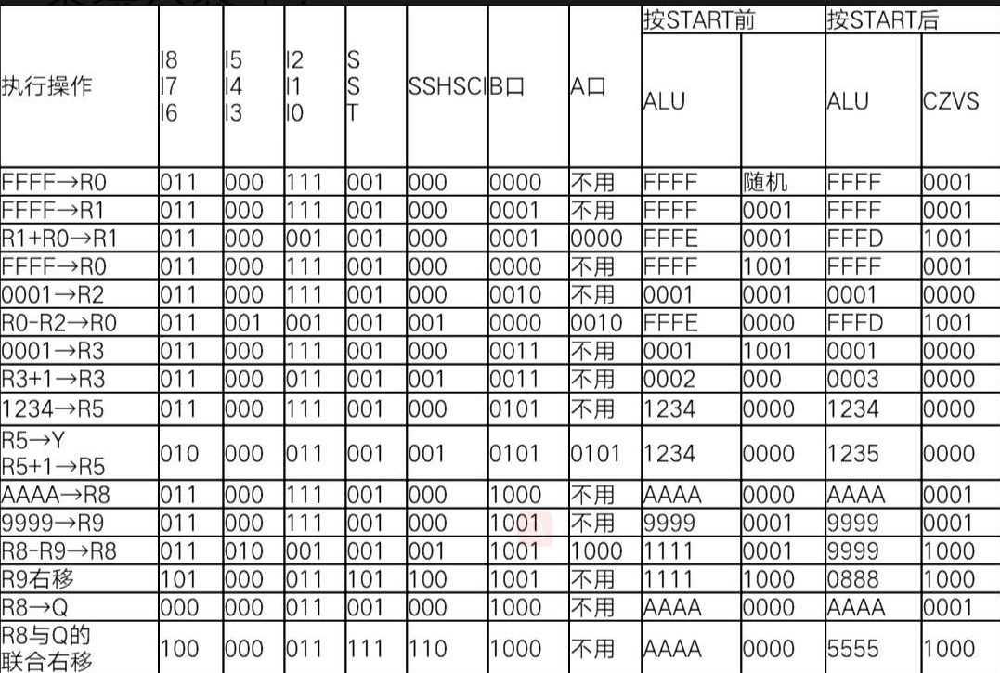

# 
 运算器实验报告

## 一、实验数据表格   

## 二、各个字段功能分析
&nbsp;　　1、I8-I6 :查询表2-3  F->B 输出为 F 可知需要选择L H H； 
　　２、I5-I3 :如果是加法： 则选择L  L  L； 如果是减法：则更具数据来源确定（第一次运算时来源为D）若是S-R则选择L L H 反之选择L H L;  
　　3、I2-I0 :根据表2-2的数据来源确定，第一次为H H H；其他的根据端口确定即可; 
　　4、SST   :如果有位数的移动，则SST的值要发生变化，参考表2-6； 要存入（记录传入熟路）时，选择L L H ;  
　　5、SSHSCI ：参考表2-4 如果是加法 则选择0 0 0；如果是减法则选择001（该算法减法时加上补码再加1）； 
　　６、A口、Ｂ口分析：　端口只是显示当前的数据放在的位置，以及要取出数据时找到对应的端口即可； 
　　7、START作用分析： 按下之前时刚操作完成时的结果，按下时再次执行操作。
## 三、1的产生方式
&nbsp; 　 1的产生方法，除了通过ALU最低位进位产生外，还可能通过D* 产生；
## 四、小组打分
&nbsp;组员：　徐晟　分数：90　牛兴炜： 85     
　　　打分依据： 徐晟解释清楚 A口、B口以及SSHSCI的功能；本人解释清楚移位操作 
    　　　另外： 实验中二人相互合作，共同探讨，但是仍有部分未能完全理解。</size> 
    　
牛兴炜：15281129

　　　　　　